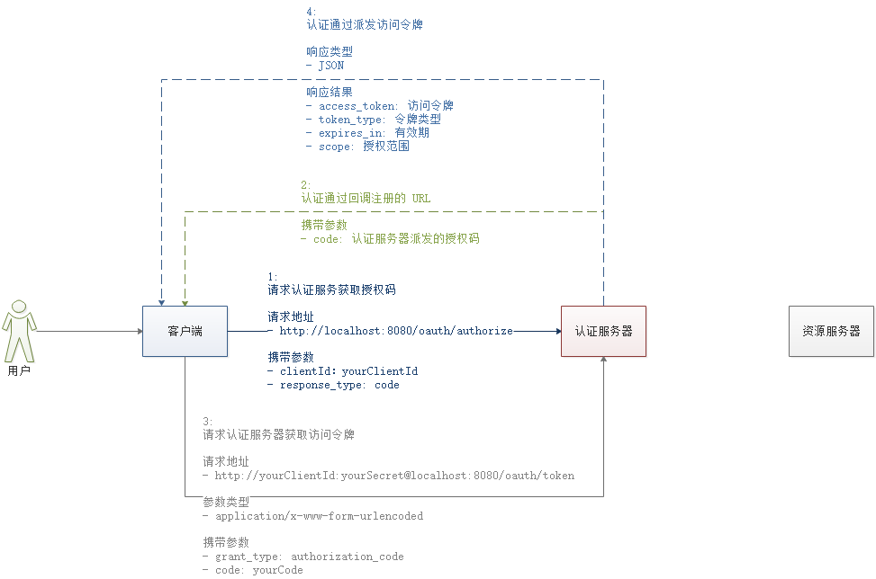

# Readme

##Group Members
16301095 李星原
16301099 莫日根呼

[TOC]

## 1.Use Springboot and Spring data Jpa

Springframework版本号:

```
<groupId>org.springframework.boot</groupId>
<artifactId>spring-boot-starter-parent</artifactId>
<version>2.1.3.RELEASE</version>
```

配置文件pom.xml:


tables:


## 2.Data Structrue

Member.java:

```java
/**
 * Entity Member
 */
@Entity
public class Member implements Serializable {

    private static final Long serialVersionUID = 1L;

    @Id
    @GeneratedValue(strategy = GenerationType.IDENTITY)
    private Integer id;

    @Size(min = 6,message = "Username must longer than 6!")
    @NotEmpty(message = "Username is required")
    private String userName;

    @NotEmpty(message = "Password is required.")
    private String password;

    @Size(min = 11, max = 11, message = "Mobile no. must be 11 digits.")
    @NotEmpty(message = "Mobile no. is required.")
    private String mobileNumber;

    @NotEmpty(message = "Address no. is required.")
    private String address;

    private String sign;

    @ManyToMany(cascade = CascadeType.PERSIST, fetch = FetchType.EAGER)
    @JoinTable(name = "member_worker",
            joinColumns = @JoinColumn(name="member_id"),
            inverseJoinColumns = @JoinColumn(name = "worker_id"))
    @JsonIgnoreProperties("members")
    private List<Worker> workers=new ArrayList<>();
    
    Getter() and Setter()...
}
```


Worker.java:

```java
@Entity
public class Worker implements Serializable {

    private static final long serialVersionUID = 1L;

    @Id
    @GeneratedValue(strategy = GenerationType.IDENTITY)
    private Integer id;

    @Size(min = 2, message = "First Name must be at least 2 characters.")
    @NotEmpty(message = "First Name is required.")
    private String firstName;

    @Size(min = 2, message = "Last Name must be at least 2 characters.")
    @NotEmpty(message = "Last Name is required.")
    private String lastName;

    @Size(min = 11, max = 11, message = "Mobile no. must be 11 digits.")
    @NotEmpty(message = "Mobile no. is required.")
    private String mobileNumber;

    @NotEmpty(message = "Address is required.")
    private String address;

    @ManyToMany(cascade = CascadeType.PERSIST, fetch = FetchType.EAGER)
    @JoinTable(name = "member_worker",
            joinColumns = @JoinColumn(name = "worker_id"),
            inverseJoinColumns = @JoinColumn(name = "member_id"))
    @JsonIgnoreProperties("workers")
    private List<Member> members = new ArrayList<>();
	
    Getter() and Setter()...
}
```


## 3.Restful Services

Example:

```
    @ApiOperation("查看成员列表")
    @ApiImplicitParam(name = "page",value = "页码,每页5个成员")
    @GetMapping("")
    public ResponseEntity<List<Member>> getMemberAndWorkers(@RequestParam(name = "page", defaultValue = "1") int page) {
        log.debug("Get all members.");
        Pageable pageable = new PageRequest(page - 1, 5);
        Page<Member> members;
        CacheControl cacheControl = CacheControl.maxAge(30, TimeUnit.MINUTES);
//        if (redisTemplate.opsForValue().get("members" + "_" + pageable.getPageNumber()) != null) {
//            members = (Page<Member>) redisTemplate.opsForValue().get("members" + "_" + pageable.getPageNumber());
//        } else {
        members = this.memberService.getMembers(pageable);
//            redisTemplate.opsForValue().set("members" + "_" + pageable.getPageNumber(), members);
//        }

        return ResponseEntity.ok()
                .cacheControl(cacheControl)
                .headers(PaginationUtil.generatePaginationHttpHeaders(members, "/api/members"))
                .body(members.getContent());
    }
```


## 4.Api version

```
@ApiOperation("查看成员列表")
@ApiImplicitParam(name = "page",value = "页码,每页5个成员")
@GetMapping("")
```

```
@ApiOperation("选择教练")
@ApiImplicitParam(name = "workerId",value = "教练Id")
@GetMapping("/select/{workerId}")
public ResponseEntity<Worker> selectWorker(@PathVariable Integer workerId, HttpServletRequest request) 
```

```
@ApiOperation("删除教练信息")
@ApiImplicitParam(name = "page",value = "页码,每页5个成员")
@RequestMapping(value = "/delete/{id}", method = RequestMethod.GET)
public ResponseEntity<Void> deleteWorker(@PathVariable Integer id) 
```

```
@ApiOperation("通过Id查看教练信息")
@ApiImplicitParam(name = "id",value = "id")
@RequestMapping(value = "/view/{id}", method = RequestMethod.GET)
public ResponseEntity<Worker> viewWorker(@PathVariable Integer id) 
```

```
@ApiOperation("查看教练列表")
@ApiImplicitParam(name = "page",value = "页码,每页5个成员")
@GetMapping("/index")
public ResponseEntity<List<Worker>> getAllWorkers(@RequestParam(name = "page", defaultValue = "1") int page) 
```

......	

## 5.Api document 

Swagger2:


## 6.Hateaos

#### 使用ResourceSupport类扩展资源模型

​	扩展Gym类 - extends`org.springframework.hateoas.ResourceSupport`类。

```
Link selfLink = ControllerLinkBuilder.linkTo(ControllerLinkBuilder
        .methodOn(GymController.class).getGym())
        .withSelfRel();
gym.add(selfLink);
return ResponseEntity.ok()
        .headers(HeaderUtil.createAlert("aaa",gym.getName()))
        .body(gym);
```

## 7.Cache

Http cache:

​	使用CacheControl定时控制缓存：

```
    public ResponseEntity<List<Member>> getMemberAndWorkers(@RequestParam(name = "page", defaultValue = "1") int page) {
        log.debug("Get all members.");
        Pageable pageable = new PageRequest(page - 1, 5);
        Page<Member> members;
        CacheControl cacheControl = CacheControl.maxAge(30, TimeUnit.MINUTES);
//        if (redisTemplate.opsForValue().get("members" + "_" + pageable.getPageNumber()) != null) {
//            members = (Page<Member>) redisTemplate.opsForValue().get("members" + "_" + pageable.getPageNumber());
//        } else {
        members = this.memberService.getMembers(pageable);

        Link selfLink = ControllerLinkBuilder.linkTo(ControllerLinkBuilder
        .methodOn(MemberController.class).getMemberAndWorkers(page))
                .withSelfRel();
//            redisTemplate.opsForValue().set("members" + "_" + pageable.getPageNumber(), members);
//        }


        return ResponseEntity.ok()
                .cacheControl(cacheControl)
                .headers(PaginationUtil.generatePaginationHttpHeaders(members, "/api/members"))
                .body(members.getContent());
    }
```

Redis cache:

​	使用RedisTemplet对查询对象进行序列化存储到redis服务器中。再次查询时检查到有存储对象就直接从redis服务器中提取。

```
package com.example.jpademo;


import com.sun.xml.internal.ws.encoding.soap.SerializationException;
import org.springframework.core.convert.converter.Converter;
import org.springframework.core.serializer.support.DeserializingConverter;
import org.springframework.core.serializer.support.SerializingConverter;
import org.springframework.data.redis.serializer.RedisSerializer;

public class ObjectRedisSerializer implements RedisSerializer<Object> {

    /**
     * 定义序列化和反序列化转化类
     */
    private Converter<Object, byte[]> serializer = new SerializingConverter();
    private Converter<byte[], Object> deserializer = new DeserializingConverter();

    /**
     * 定义转换空字节数组
     */
    private static final byte[] EMPTY_ARRAY = new byte[0];

    @Override
    public byte[] serialize(Object obj) throws SerializationException {
        byte[] byteArray = null;
        if (null == obj) {
            System.err.println("----------------------------->:Redis待序列化的对象为空.");
            byteArray = EMPTY_ARRAY;
        } else {
            try {
                byteArray = serializer.convert(obj);
            } catch (Exception e) {
                System.err.println("----------------------------->Redis序列化对象失败,异常："+e.getMessage());
                byteArray = EMPTY_ARRAY;
            }
        }
        return byteArray;
    }

    @Override
    public Object deserialize(byte[] datas) throws SerializationException {
        Object obj = null;
        if((null == datas)|| (datas.length == 0)){
            System.out.println("---------------------------------->Redis待反序列化的对象为空.");
        }else{
            try {
                obj = deserializer.convert(datas);
            } catch (Exception e) {
                System.out.println("------------------------------------->Redis反序列化对象失败,异常："+e.getMessage());
            }
        }
        return obj;
    }
}
```

## 8.Authentication oauth2

流程：


Application.yml关于oauth2配置:

```java
spring:
      security:
        oauth2:
          client:
            client-id: client
            client-secret: secret
            access-token-uri: http://localhost:8081/oauth/token
            user-authorization-uri: http://localhost:8081/oauth/authorize
          resource:
            token-info-uri: http://localhost:8081/oauth/check_token
```

使用Jpa查询member表中对象，然后通过角色role进行权限分配：


